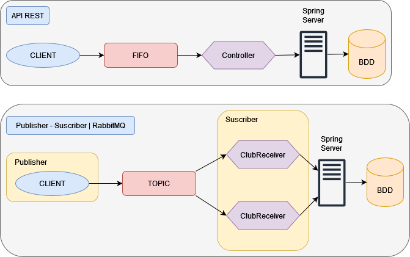

#TP CLERC - LANGLOIS SDIS

##Travaille realisé
Nous avons commencé par refactoriser le code de l'application pour le rendre plus facile à utiliser.
###Student controler

- Creation d'un Student
- Édition d'un Student
- Suppression d'un Student
- Recherche d'un Student
- Affectation de la présidence d'un club à un Student qui fait partie du club.

Nous avons ensuite réaliser de nombreux tests épartis dans 4 fichiers : 

- 3 fichiers de tests unitaires : StudentServiceTest, StudentServiceMockTest et StudentRepositoryTest
- 1 fichier de tests d'integrations : StudentControllerTest

##Club controler
Nous avons rajouté plusieurs méthodes au club controler

- Méthode pour ajouter un Student à un club.
- Méthode pour supprimer un Student appartenant à un club.
- Méthode pour affecter un président à un club.

Ces modifications se sont accompagnées de tests unitaires et d'intégration afin de s'assure du bon fonctionnement.
Nous avons aussi changé des méthodes dans le modèle du Controller afin d'éviter une recursion infinie lors de la 
sérialisation des données.

##RabbitMQ 

Nous avons mis en place l'architecture ci-dessus pour l'application du TP RabbitMQ. 

Afin de faire fonctionner ce projet, il nous a fallu créer une fonction effectuant une requête HTTP sur le serveur REST. 
Pour vérifier que cela fonctionne, nous avons réaliser divers tests unitaires qui vérifie que les retours des requêtes 
HTTP sont bien celles attendues. 
